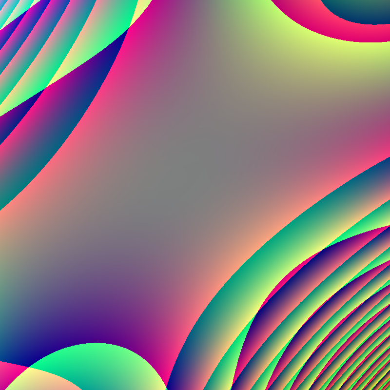

# RandomArt

RandomArt idea implementation from http://users.ece.cmu.edu/~adrian/projects/validation/validation.pdf



Above image is generated by function:

```
(add(mult(mult(add(add(add(mult(x, x), mult(x, -0.809645)), mult(add(x, x), add(y, y))), add(mult(mult(0.674010, -0.232019), mult(0.241232, -0.695217)), add(add(x, y), 0.990269))), add(0.090850, add(add(0.164064, x), y))), add(x, y)), mult(x, mult(y, add(y, add(add(mult(x, 0.265273), mult(x, 0.237908)), y))))), mult(add(mult(add(add(mult(mult(0.623806, 0.849694), add(0.416674, 0.995028)), mult(add(0.769761, y), add(0.312180, x))), add(add(add(y, y), mult(y, x)), add(mult(x, -0.266506), add(y, x)))), add(x, mult(add(add(-0.571854, 0.355479), -0.964695), mult(mult(-0.369294, x), mult(x, x))))), add(mult(add(add(x, mult(x, y)), mult(mult(x, y), add(0.518688, x))), add(mult(mult(y, x), x), mult(x, y))), add(mult(add(x, mult(x, y)), x), mult(mult(0.620817, add(0.145679, y)), add(add(x, x), -0.489522))))), y), mult(mult(add(mult(x, add(-0.309250, mult(mult(y, 0.040173), mult(x, x)))), mult(mult(mult(add(x, x), -0.915736), mult(y, 0.117940)), add(x, mult(y, 0.396394)))), y), y))
```

https://github.com/user-attachments/assets/801dd99c-6082-4e83-b7cd-0c666f758a45

*The function that generated above video is to big to fit in this README.*

## Quick Start

### Generate file

```console
$ cc -o nob nob.c
$ ./nob run file output.png
$ feh output.png
```

### Compile to GLSL shader and display interactively

```console
$ cc -o nob nob.c
$ ./nob run gui
$ feh output.png
```
